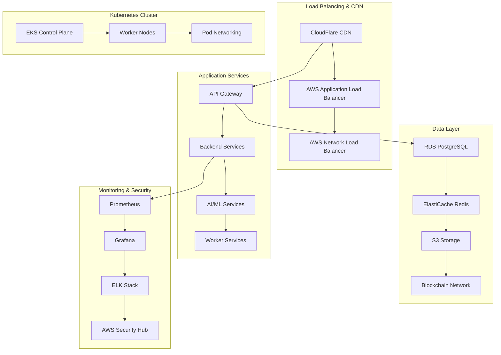

# SecureAI DeepFake Detection System
## Production Infrastructure & Deployment

### 🏗️ Production Environment Setup

This comprehensive guide covers production infrastructure setup, monitoring, scaling, and deployment automation for the SecureAI DeepFake Detection System.

---

## 🎯 Infrastructure Overview

### **Production Architecture**



### **Infrastructure Components**

#### **Compute Infrastructure**
- **Kubernetes**: Amazon EKS cluster with managed node groups
- **Auto Scaling**: Horizontal Pod Autoscaler (HPA) and Cluster Autoscaler
- **GPU Support**: NVIDIA GPU instances for AI/ML workloads
- **Spot Instances**: Cost optimization with spot instance integration

#### **Storage & Database**
- **Primary Database**: Amazon RDS PostgreSQL with Multi-AZ deployment
- **Cache Layer**: Amazon ElastiCache Redis cluster
- **Object Storage**: Amazon S3 with lifecycle policies
- **Block Storage**: Amazon EBS with encryption

#### **Networking & Security**
- **VPC**: Private subnets with NAT Gateway
- **Load Balancers**: Application and Network Load Balancers
- **CDN**: CloudFlare for global content delivery
- **Security Groups**: Restrictive network access controls

---

## 🚀 Production Deployment Setup

### **AWS Infrastructure as Code**

#### **Terraform Configuration**
```hcl
# main.tf - Main Terraform configuration
terraform {
  required_version = ">= 1.0"
  required_providers {
    aws = {
      source  = "hashicorp/aws"
      version = "~> 5.0"
    }
  }
  
  backend "s3" {
    bucket = "secureai-terraform-state"
    key    = "production/terraform.tfstate"
    region = "us-west-2"
  }
}

provider "aws" {
  region = var.aws_region
  
  default_tags {
    tags = {
      Environment = var.environment
      Project     = "SecureAI"
      ManagedBy   = "Terraform"
    }
  }
}

# VPC Configuration
module "vpc" {
  source = "terraform-aws-modules/vpc/aws"
  
  name = "secureai-vpc"
  cidr = "10.0.0.0/16"
  
  azs             = ["us-west-2a", "us-west-2b", "us-west-2c"]
  private_subnets = ["10.0.1.0/24", "10.0.2.0/24", "10.0.3.0/24"]
  public_subnets  = ["10.0.101.0/24", "10.0.102.0/24", "10.0.103.0/24"]
  
  enable_nat_gateway = true
  enable_vpn_gateway = true
  enable_dns_hostnames = true
  enable_dns_support = true
  
  tags = {
    Name = "secureai-vpc"
  }
}

# EKS Cluster
module "eks" {
  source = "terraform-aws-modules/eks/aws"
  
  cluster_name    = "secureai-cluster"
  cluster_version = "1.28"
  
  vpc_id                         = module.vpc.vpc_id
  subnet_ids                     = module.vpc.private_subnets
  cluster_endpoint_public_access = true
  
  # EKS Managed Node Groups
  eks_managed_node_groups = {
    general = {
      name = "general-nodes"
      
      instance_types = ["t3.large", "t3.xlarge"]
      
      min_size     = 2
      max_size     = 10
      desired_size = 3
      
      disk_size = 50
      
      labels = {
        node-type = "general"
      }
    }
    
    gpu = {
      name = "gpu-nodes"
      
      instance_types = ["g4dn.xlarge", "g4dn.2xlarge"]
      
      min_size     = 1
      max_size     = 5
      desired_size = 2
      
      disk_size = 100
      
      labels = {
        node-type = "gpu"
      }
      
      taints = [{
        key    = "nvidia.com/gpu"
        value  = "true"
        effect = "NO_SCHEDULE"
      }]
    }
  }
  
  # Cluster access entry
  manage_aws_auth_configmap = true
  aws_auth_roles = [
    {
      rolearn  = aws_iam_role.admin_role.arn
      username = "admin"
      groups   = ["system:masters"]
    },
  ]
}

# RDS PostgreSQL
resource "aws_db_instance" "postgres" {
  identifier = "secureai-postgres"
  
  engine         = "postgres"
  engine_version = "15.4"
  instance_class = "db.r6g.xlarge"
  
  allocated_storage     = 500
  max_allocated_storage = 1000
  storage_type          = "gp3"
  storage_encrypted     = true
  
  db_name  = "secureai_production"
  username = "secureai_admin"
  password = var.db_password
  
  vpc_security_group_ids = [aws_security_group.rds.id]
  db_subnet_group_name   = aws_db_subnet_group.main.name
  
  backup_retention_period = 7
  backup_window          = "03:00-04:00"
  maintenance_window     = "sun:04:00-sun:05:00"
  
  multi_az = true
  
  deletion_protection = true
  
  tags = {
    Name = "secureai-postgres"
  }
}

# ElastiCache Redis
resource "aws_elasticache_replication_group" "redis" {
  replication_group_id       = "secureai-redis"
  description                = "Redis cluster for SecureAI"
  
  node_type                  = "cache.r6g.large"
  port                       = 6379
  parameter_group_name       = "default.redis7"
  
  num_cache_clusters         = 2
  
  subnet_group_name          = aws_elasticache_subnet_group.main.name
  security_group_ids         = [aws_security_group.redis.id]
  
  at_rest_encryption_enabled = true
  transit_encryption_enabled = true
  auth_token                 = var.redis_auth_token
  
  tags = {
    Name = "secureai-redis"
  }
}

# S3 Bucket
resource "aws_s3_bucket" "secureai_storage" {
  bucket = "secureai-production-storage"
  
  tags = {
    Name = "secureai-storage"
  }
}

resource "aws_s3_bucket_versioning" "secureai_storage" {
  bucket = aws_s3_bucket.secureai_storage.id
  versioning_configuration {
    status = "Enabled"
  }
}

resource "aws_s3_bucket_server_side_encryption_configuration" "secureai_storage" {
  bucket = aws_s3_bucket.secureai_storage.id
  
  rule {
    apply_server_side_encryption_by_default {
      sse_algorithm = "AES256"
    }
  }
}
```

### **Kubernetes Manifests**

#### **Namespace and ConfigMaps**
```yaml
# namespace.yaml
apiVersion: v1
kind: Namespace
metadata:
  name: secureai-production
  labels:
    name: secureai-production
    environment: production

---
# configmap.yaml
apiVersion: v1
kind: ConfigMap
metadata:
  name: secureai-config
  namespace: secureai-production
data:
  application.yml: |
    server:
      port: 8000
      max-threads: 200
      min-threads: 10
    
    database:
      url: ${DATABASE_URL}
      pool:
        max-size: 50
        min-size: 5
        connection-timeout: 30s
    
    cache:
      redis:
        url: ${REDIS_URL}
        max-connections: 100
        timeout: 5000ms
    
    processing:
      max-concurrent-analyses: 100
      analysis-timeout: 300s
      gpu-enabled: true
    
    security:
      jwt:
        secret: ${JWT_SECRET}
        expiration: 3600
      encryption:
        key: ${ENCRYPTION_KEY}
    
    blockchain:
      network: ${BLOCKCHAIN_NETWORK}
      rpc-url: ${BLOCKCHAIN_RPC_URL}
      program-id: ${BLOCKCHAIN_PROGRAM_ID}

---
# secrets.yaml
apiVersion: v1
kind: Secret
metadata:
  name: secureai-secrets
  namespace: secureai-production
type: Opaque
data:
  database-url: <base64-encoded-database-url>
  redis-url: <base64-encoded-redis-url>
  jwt-secret: <base64-encoded-jwt-secret>
  encryption-key: <base64-encoded-encryption-key>
  blockchain-program-id: <base64-encoded-program-id>
```

#### **Application Deployments**
```yaml
# backend-deployment.yaml
apiVersion: apps/v1
kind: Deployment
metadata:
  name: secureai-backend
  namespace: secureai-production
  labels:
    app: secureai-backend
    version: v1.0.0
spec:
  replicas: 3
  selector:
    matchLabels:
      app: secureai-backend
  template:
    metadata:
      labels:
        app: secureai-backend
        version: v1.0.0
    spec:
      containers:
      - name: secureai-backend
        image: secureai/backend:latest
        ports:
        - containerPort: 8000
        env:
        - name: DATABASE_URL
          valueFrom:
            secretKeyRef:
              name: secureai-secrets
              key: database-url
        - name: REDIS_URL
          valueFrom:
            secretKeyRef:
              name: secureai-secrets
              key: redis-url
        resources:
          requests:
            memory: "1Gi"
            cpu: "500m"
          limits:
            memory: "2Gi"
            cpu: "1000m"
        livenessProbe:
          httpGet:
            path: /health
            port: 8000
          initialDelaySeconds: 30
          periodSeconds: 10
        readinessProbe:
          httpGet:
            path: /ready
            port: 8000
          initialDelaySeconds: 5
          periodSeconds: 5
      nodeSelector:
        node-type: general

---
# ai-service-deployment.yaml
apiVersion: apps/v1
kind: Deployment
metadata:
  name: secureai-ai-service
  namespace: secureai-production
  labels:
    app: secureai-ai-service
spec:
  replicas: 2
  selector:
    matchLabels:
      app: secureai-ai-service
  template:
    metadata:
      labels:
        app: secureai-ai-service
    spec:
      containers:
      - name: secureai-ai-service
        image: secureai/ai-service:latest
        ports:
        - containerPort: 8080
        resources:
          requests:
            memory: "4Gi"
            cpu: "1000m"
            nvidia.com/gpu: 1
          limits:
            memory: "8Gi"
            cpu: "2000m"
            nvidia.com/gpu: 1
        env:
        - name: CUDA_VISIBLE_DEVICES
          value: "0"
        - name: MODEL_PATH
          value: "/models"
        volumeMounts:
        - name: model-storage
          mountPath: /models
      volumes:
      - name: model-storage
        persistentVolumeClaim:
          claimName: model-storage-pvc
      nodeSelector:
        node-type: gpu
      tolerations:
      - key: nvidia.com/gpu
        operator: Exists
        effect: NoSchedule
```

---

## 📊 Monitoring & Observability

### **Prometheus Configuration**

#### **Prometheus Setup**
```yaml
# prometheus-deployment.yaml
apiVersion: apps/v1
kind: Deployment
metadata:
  name: prometheus
  namespace: monitoring
spec:
  replicas: 1
  selector:
    matchLabels:
      app: prometheus
  template:
    metadata:
      labels:
        app: prometheus
    spec:
      containers:
      - name: prometheus
        image: prom/prometheus:v2.47.0
        ports:
        - containerPort: 9090
        volumeMounts:
        - name: config
          mountPath: /etc/prometheus
        - name: storage
          mountPath: /prometheus
        resources:
          requests:
            memory: "2Gi"
            cpu: "500m"
          limits:
            memory: "4Gi"
            cpu: "1000m"
      volumes:
      - name: config
        configMap:
          name: prometheus-config
      - name: storage
        persistentVolumeClaim:
          claimName: prometheus-storage-pvc

---
# prometheus-configmap.yaml
apiVersion: v1
kind: ConfigMap
metadata:
  name: prometheus-config
  namespace: monitoring
data:
  prometheus.yml: |
    global:
      scrape_interval: 15s
      evaluation_interval: 15s
    
    rule_files:
      - "secureai_rules.yml"
    
    scrape_configs:
      - job_name: 'kubernetes-pods'
        kubernetes_sd_configs:
          - role: pod
        relabel_configs:
          - source_labels: [__meta_kubernetes_pod_annotation_prometheus_io_scrape]
            action: keep
            regex: true
          - source_labels: [__meta_kubernetes_pod_annotation_prometheus_io_path]
            action: replace
            target_label: __metrics_path__
            regex: (.+)
      
      - job_name: 'secureai-backend'
        static_configs:
          - targets: ['secureai-backend:8000']
        metrics_path: /metrics
        scrape_interval: 10s
      
      - job_name: 'secureai-ai-service'
        static_configs:
          - targets: ['secureai-ai-service:8080']
        metrics_path: /metrics
        scrape_interval: 10s
      
      - job_name: 'postgres-exporter'
        static_configs:
          - targets: ['postgres-exporter:9187']
      
      - job_name: 'redis-exporter'
        static_configs:
          - targets: ['redis-exporter:9121']
    
    alerting:
      alertmanagers:
        - static_configs:
            - targets:
              - alertmanager:9093
```

### **Grafana Dashboards**

#### **System Overview Dashboard**
```json
{
  "dashboard": {
    "title": "SecureAI Production Overview",
    "panels": [
      {
        "title": "System Health",
        "type": "stat",
        "targets": [
          {
            "expr": "up{job=\"secureai-backend\"}",
            "legendFormat": "Backend Status"
          },
          {
            "expr": "up{job=\"secureai-ai-service\"}",
            "legendFormat": "AI Service Status"
          },
          {
            "expr": "up{job=\"postgres-exporter\"}",
            "legendFormat": "Database Status"
          }
        ]
      },
      {
        "title": "Request Rate",
        "type": "graph",
        "targets": [
          {
            "expr": "rate(http_requests_total[5m])",
            "legendFormat": "Requests/sec"
          }
        ]
      },
      {
        "title": "Response Time",
        "type": "graph",
        "targets": [
          {
            "expr": "histogram_quantile(0.95, rate(http_request_duration_seconds_bucket[5m]))",
            "legendFormat": "95th percentile"
          }
        ]
      },
      {
        "title": "Error Rate",
        "type": "graph",
        "targets": [
          {
            "expr": "rate(http_requests_total{status=~\"5..\"}[5m])",
            "legendFormat": "5xx errors/sec"
          }
        ]
      },
      {
        "title": "Analysis Throughput",
        "type": "graph",
        "targets": [
          {
            "expr": "rate(secureai_video_analyses_total[5m])",
            "legendFormat": "Analyses/sec"
          }
        ]
      },
      {
        "title": "GPU Utilization",
        "type": "graph",
        "targets": [
          {
            "expr": "nvidia_utilization_gpu",
            "legendFormat": "GPU {{instance}}"
          }
        ]
      }
    ]
  }
}
```

### **Alerting Rules**

#### **Critical Alerts**
```yaml
# alerting-rules.yaml
apiVersion: monitoring.coreos.com/v1
kind: PrometheusRule
metadata:
  name: secureai-alerts
  namespace: monitoring
spec:
  groups:
  - name: secureai_critical
    rules:
      - alert: SecureAIBackendDown
        expr: up{job="secureai-backend"} == 0
        for: 1m
        labels:
          severity: critical
        annotations:
          summary: "SecureAI backend is down"
          description: "SecureAI backend has been down for more than 1 minute"
      
      - alert: HighErrorRate
        expr: rate(http_requests_total{status=~"5.."}[5m]) > 0.1
        for: 2m
        labels:
          severity: critical
        annotations:
          summary: "High error rate detected"
          description: "Error rate is {{ $value }} errors per second"
      
      - alert: DatabaseConnectionHigh
        expr: pg_stat_database_numbackends / pg_settings_max_connections > 0.8
        for: 2m
        labels:
          severity: warning
        annotations:
          summary: "High database connection usage"
          description: "Database connections are at {{ $value }}% of maximum"
      
      - alert: AnalysisQueueBacklog
        expr: secureai_analysis_queue_size > 100
        for: 5m
        labels:
          severity: warning
        annotations:
          summary: "Analysis queue backlog"
          description: "Analysis queue has {{ $value }} pending jobs"
      
      - alert: HighMemoryUsage
        expr: (container_memory_usage_bytes / container_spec_memory_limit_bytes) > 0.8
        for: 5m
        labels:
          severity: warning
        annotations:
          summary: "High memory usage"
          description: "Container {{ $labels.name }} is using {{ $value }}% of memory"
      
      - alert: DiskSpaceLow
        expr: (node_filesystem_avail_bytes / node_filesystem_size_bytes) < 0.1
        for: 5m
        labels:
          severity: critical
        annotations:
          summary: "Disk space low"
          description: "Node {{ $labels.instance }} has only {{ $value }}% disk space available"
```

---

## 📈 Scaling & Performance

### **Horizontal Pod Autoscaler**

#### **Backend Service HPA**
```yaml
# hpa-backend.yaml
apiVersion: autoscaling/v2
kind: HorizontalPodAutoscaler
metadata:
  name: secureai-backend-hpa
  namespace: secureai-production
spec:
  scaleTargetRef:
    apiVersion: apps/v1
    kind: Deployment
    name: secureai-backend
  minReplicas: 3
  maxReplicas: 20
  metrics:
  - type: Resource
    resource:
      name: cpu
      target:
        type: Utilization
        averageUtilization: 70
  - type: Resource
    resource:
      name: memory
      target:
        type: Utilization
        averageUtilization: 80
  behavior:
    scaleDown:
      stabilizationWindowSeconds: 300
      policies:
      - type: Percent
        value: 10
        periodSeconds: 60
    scaleUp:
      stabilizationWindowSeconds: 60
      policies:
      - type: Percent
        value: 100
        periodSeconds: 60
      - type: Pods
        value: 4
        periodSeconds: 60
      selectPolicy: Max

---
# hpa-ai-service.yaml
apiVersion: autoscaling/v2
kind: HorizontalPodAutoscaler
metadata:
  name: secureai-ai-service-hpa
  namespace: secureai-production
spec:
  scaleTargetRef:
    apiVersion: apps/v1
    kind: Deployment
    name: secureai-ai-service
  minReplicas: 2
  maxReplicas: 10
  metrics:
  - type: Resource
    resource:
      name: cpu
      target:
        type: Utilization
        averageUtilization: 60
  - type: Resource
    resource:
      name: nvidia.com/gpu
      target:
        type: Utilization
        averageUtilization: 70
  - type: Pods
    pods:
      metric:
        name: secureai_analysis_queue_size
      target:
        type: AverageValue
        averageValue: "10"
```

### **Cluster Autoscaler**

#### **Node Group Scaling**
```yaml
# cluster-autoscaler.yaml
apiVersion: apps/v1
kind: Deployment
metadata:
  name: cluster-autoscaler
  namespace: kube-system
spec:
  replicas: 1
  selector:
    matchLabels:
      app: cluster-autoscaler
  template:
    metadata:
      labels:
        app: cluster-autoscaler
    spec:
      containers:
      - name: cluster-autoscaler
        image: k8s.gcr.io/autoscaling/cluster-autoscaler:v1.28.0
        command:
        - ./cluster-autoscaler
        - --v=4
        - --stderrthreshold=info
        - --cloud-provider=aws
        - --skip-nodes-with-local-storage=false
        - --expander=least-waste
        - --node-group-auto-discovery=asg:tag=k8s.io/cluster-autoscaler/enabled,k8s.io/cluster-autoscaler/secureai-cluster
        - --balance-similar-node-groups
        - --scale-down-enabled=true
        - --scale-down-delay-after-add=10m
        - --scale-down-unneeded-time=10m
        resources:
          requests:
            memory: "100Mi"
            cpu: "100m"
          limits:
            memory: "300Mi"
            cpu: "100m"
        env:
        - name: AWS_REGION
          value: us-west-2
```

---

## 🔄 CI/CD Pipeline

### **GitHub Actions Workflow**

#### **Production Deployment Pipeline**
```yaml
# .github/workflows/production-deploy.yml
name: Production Deployment

on:
  push:
    branches: [main]
  workflow_dispatch:

env:
  AWS_REGION: us-west-2
  EKS_CLUSTER_NAME: secureai-cluster
  NAMESPACE: secureai-production

jobs:
  test:
    runs-on: ubuntu-latest
    steps:
    - uses: actions/checkout@v3
    
    - name: Set up Python
      uses: actions/setup-python@v4
      with:
        python-version: '3.11'
    
    - name: Install dependencies
      run: |
        pip install -r requirements.txt
        pip install -r requirements-dev.txt
    
    - name: Run tests
      run: |
        pytest tests/ --cov=src --cov-report=xml
    
    - name: Run security scan
      run: |
        bandit -r src/
        safety check
    
    - name: Upload coverage
      uses: codecov/codecov-action@v3

  build:
    needs: test
    runs-on: ubuntu-latest
    outputs:
      image-tag: ${{ steps.meta.outputs.tags }}
    steps:
    - uses: actions/checkout@v3
    
    - name: Set up Docker Buildx
      uses: docker/setup-buildx-action@v2
    
    - name: Log in to ECR
      uses: aws-actions/amazon-ecr-login@v1
    
    - name: Extract metadata
      id: meta
      uses: docker/metadata-action@v4
      with:
        images: ${{ secrets.AWS_ACCOUNT_ID }}.dkr.ecr.us-west-2.amazonaws.com/secureai
        tags: |
          type=ref,event=branch
          type=ref,event=pr
          type=sha,prefix={{branch}}-
    
    - name: Build and push backend image
      uses: docker/build-push-action@v4
      with:
        context: ./backend
        push: true
        tags: ${{ steps.meta.outputs.tags }}-backend
        cache-from: type=gha
        cache-to: type=gha,mode=max
    
    - name: Build and push AI service image
      uses: docker/build-push-action@v4
      with:
        context: ./ai-service
        push: true
        tags: ${{ steps.meta.outputs.tags }}-ai-service
        cache-from: type=gha
        cache-to: type=gha,mode=max

  deploy:
    needs: build
    runs-on: ubuntu-latest
    environment: production
    steps:
    - uses: actions/checkout@v3
    
    - name: Configure AWS credentials
      uses: aws-actions/configure-aws-credentials@v2
      with:
        aws-access-key-id: ${{ secrets.AWS_ACCESS_KEY_ID }}
        aws-secret-access-key: ${{ secrets.AWS_SECRET_ACCESS_KEY }}
        aws-region: ${{ env.AWS_REGION }}
    
    - name: Update kubeconfig
      run: |
        aws eks update-kubeconfig --region ${{ env.AWS_REGION }} --name ${{ env.EKS_CLUSTER_NAME }}
    
    - name: Deploy to Kubernetes
      run: |
        # Update image tags in deployment manifests
        sed -i "s|secureai/backend:latest|${{ needs.build.outputs.image-tag }}-backend|g" k8s/backend-deployment.yaml
        sed -i "s|secureai/ai-service:latest|${{ needs.build.outputs.image-tag }}-ai-service|g" k8s/ai-service-deployment.yaml
        
        # Apply deployments
        kubectl apply -f k8s/
        
        # Wait for rollout
        kubectl rollout status deployment/secureai-backend -n ${{ env.NAMESPACE }}
        kubectl rollout status deployment/secureai-ai-service -n ${{ env.NAMESPACE }}
    
    - name: Run health checks
      run: |
        kubectl get pods -n ${{ env.NAMESPACE }}
        kubectl get services -n ${{ env.NAMESPACE }}
        
        # Wait for services to be ready
        kubectl wait --for=condition=available --timeout=300s deployment/secureai-backend -n ${{ env.NAMESPACE }}
        kubectl wait --for=condition=available --timeout=300s deployment/secureai-ai-service -n ${{ env.NAMESPACE }}

  notify:
    needs: [test, build, deploy]
    runs-on: ubuntu-latest
    if: always()
    steps:
    - name: Notify Slack
      uses: 8398a7/action-slack@v3
      with:
        status: ${{ job.status }}
        channel: '#deployments'
        text: |
          Production deployment ${{ job.status }}!
          Branch: ${{ github.ref }}
          Commit: ${{ github.sha }}
      env:
        SLACK_WEBHOOK_URL: ${{ secrets.SLACK_WEBHOOK_URL }}
```

---

## 🛡️ Security & Compliance

### **Network Security**

#### **Security Groups**
```hcl
# security-groups.tf
resource "aws_security_group" "eks_cluster" {
  name_prefix = "secureai-eks-cluster"
  vpc_id      = module.vpc.vpc_id

  egress {
    from_port   = 0
    to_port     = 0
    protocol    = "-1"
    cidr_blocks = ["0.0.0.0/0"]
  }

  tags = {
    Name = "secureai-eks-cluster-sg"
  }
}

resource "aws_security_group" "eks_nodes" {
  name_prefix = "secureai-eks-nodes"
  vpc_id      = module.vpc.vpc_id

  ingress {
    from_port = 0
    to_port   = 65535
    protocol  = "tcp"
    self      = true
  }

  ingress {
    from_port       = 443
    to_port         = 443
    protocol        = "tcp"
    security_groups = [aws_security_group.eks_cluster.id]
  }

  egress {
    from_port   = 0
    to_port     = 0
    protocol    = "-1"
    cidr_blocks = ["0.0.0.0/0"]
  }

  tags = {
    Name = "secureai-eks-nodes-sg"
  }
}

resource "aws_security_group" "rds" {
  name_prefix = "secureai-rds"
  vpc_id      = module.vpc.vpc_id

  ingress {
    from_port       = 5432
    to_port         = 5432
    protocol        = "tcp"
    security_groups = [aws_security_group.eks_nodes.id]
  }

  egress {
    from_port   = 0
    to_port     = 0
    protocol    = "-1"
    cidr_blocks = ["0.0.0.0/0"]
  }

  tags = {
    Name = "secureai-rds-sg"
  }
}
```

### **Pod Security Policies**

#### **Security Context**
```yaml
# pod-security.yaml
apiVersion: v1
kind: PodSecurityPolicy
metadata:
  name: secureai-psp
spec:
  privileged: false
  allowPrivilegeEscalation: false
  requiredDropCapabilities:
    - ALL
  volumes:
    - 'configMap'
    - 'emptyDir'
    - 'projected'
    - 'secret'
    - 'downwardAPI'
    - 'persistentVolumeClaim'
  runAsUser:
    rule: 'MustRunAsNonRoot'
  seLinux:
    rule: 'RunAsAny'
  fsGroup:
    rule: 'RunAsAny'

---
apiVersion: v1
kind: PodSecurityPolicy
metadata:
  name: secureai-gpu-psp
spec:
  privileged: false
  allowPrivilegeEscalation: false
  requiredDropCapabilities:
    - ALL
  volumes:
    - 'configMap'
    - 'emptyDir'
    - 'projected'
    - 'secret'
    - 'downwardAPI'
    - 'persistentVolumeClaim'
    - 'hostPath'
  allowedHostPaths:
    - pathPrefix: "/dev/nvidia0"
    - pathPrefix: "/dev/nvidia1"
    - pathPrefix: "/dev/nvidiactl"
    - pathPrefix: "/dev/nvidia-uvm"
  runAsUser:
    rule: 'MustRunAsNonRoot'
  seLinux:
    rule: 'RunAsAny'
  fsGroup:
    rule: 'RunAsAny'
```

---

## 🔄 Backup & Disaster Recovery

### **Backup Strategy**

#### **Database Backup**
```yaml
# database-backup-cronjob.yaml
apiVersion: batch/v1
kind: CronJob
metadata:
  name: database-backup
  namespace: secureai-production
spec:
  schedule: "0 2 * * *"  # Daily at 2 AM
  jobTemplate:
    spec:
      template:
        spec:
          containers:
          - name: postgres-backup
            image: postgres:15
            command:
            - /bin/bash
            - -c
            - |
              PGPASSWORD=$POSTGRES_PASSWORD pg_dump -h $POSTGRES_HOST -U $POSTGRES_USER -d $POSTGRES_DB --format=custom --compress=9 > /backup/secureai_$(date +%Y%m%d_%H%M%S).backup
              aws s3 cp /backup/secureai_$(date +%Y%m%d_%H%M%S).backup s3://secureai-backups/database/
            env:
            - name: POSTGRES_HOST
              value: "postgres.secureai-production.svc.cluster.local"
            - name: POSTGRES_USER
              value: "secureai_admin"
            - name: POSTGRES_PASSWORD
              valueFrom:
                secretKeyRef:
                  name: secureai-secrets
                  key: database-password
            - name: POSTGRES_DB
              value: "secureai_production"
            - name: AWS_ACCESS_KEY_ID
              valueFrom:
                secretKeyRef:
                  name: aws-credentials
                  key: access-key-id
            - name: AWS_SECRET_ACCESS_KEY
              valueFrom:
                secretKeyRef:
                  name: aws-credentials
                  key: secret-access-key
            volumeMounts:
            - name: backup-storage
              mountPath: /backup
          volumes:
          - name: backup-storage
            emptyDir: {}
          restartPolicy: OnFailure
```

### **Disaster Recovery Plan**

#### **Multi-Region Setup**
```hcl
# disaster-recovery.tf
# Primary region (us-west-2)
module "primary_region" {
  source = "./modules/region"
  
  region = "us-west-2"
  environment = "production"
  
  providers = {
    aws = aws.primary
  }
}

# Secondary region (us-east-1)
module "secondary_region" {
  source = "./modules/region"
  
  region = "us-east-1"
  environment = "disaster-recovery"
  
  providers = {
    aws = aws.secondary
  }
}

# Cross-region replication
resource "aws_s3_bucket_replication_configuration" "secureai_storage" {
  bucket = module.primary_region.s3_bucket_id
  
  role = aws_iam_role.replication_role.arn
  
  rule {
    id     = "replicate-to-secondary"
    status = "Enabled"
    
    destination {
      bucket        = module.secondary_region.s3_bucket_arn
      storage_class = "STANDARD_IA"
    }
  }
}
```

---

## 📊 Performance Optimization

### **Resource Optimization**

#### **Resource Requests and Limits**
```yaml
# resource-optimization.yaml
apiVersion: v1
kind: ConfigMap
metadata:
  name: resource-config
  namespace: secureai-production
data:
  backend-resources.yaml: |
    resources:
      requests:
        memory: "1Gi"
        cpu: "500m"
      limits:
        memory: "2Gi"
        cpu: "1000m"
  
  ai-service-resources.yaml: |
    resources:
      requests:
        memory: "4Gi"
        cpu: "1000m"
        nvidia.com/gpu: 1
      limits:
        memory: "8Gi"
        cpu: "2000m"
        nvidia.com/gpu: 1
```

### **Performance Monitoring**

#### **Custom Metrics**
```python
# custom_metrics.py
from prometheus_client import Counter, Histogram, Gauge

# Custom metrics for SecureAI
video_analyses_total = Counter('secureai_video_analyses_total', 'Total video analyses', ['status', 'analysis_type'])
analysis_duration = Histogram('secureai_analysis_duration_seconds', 'Analysis duration', ['analysis_type'])
active_connections = Gauge('secureai_active_connections', 'Active WebSocket connections')
queue_size = Gauge('secureai_analysis_queue_size', 'Analysis queue size')
gpu_utilization = Gauge('secureai_gpu_utilization', 'GPU utilization percentage', ['gpu_id'])

# Application metrics
http_requests_total = Counter('secureai_http_requests_total', 'Total HTTP requests', ['method', 'endpoint', 'status'])
http_request_duration = Histogram('secureai_http_request_duration_seconds', 'HTTP request duration', ['method', 'endpoint'])
database_connections = Gauge('secureai_database_connections_active', 'Active database connections')
cache_hit_rate = Gauge('secureai_cache_hit_rate', 'Cache hit rate percentage')
```

---

*This production infrastructure guide provides a comprehensive foundation for deploying and managing the SecureAI DeepFake Detection System in a production environment. For additional configuration details and advanced setup procedures, refer to the specific component documentation.*
