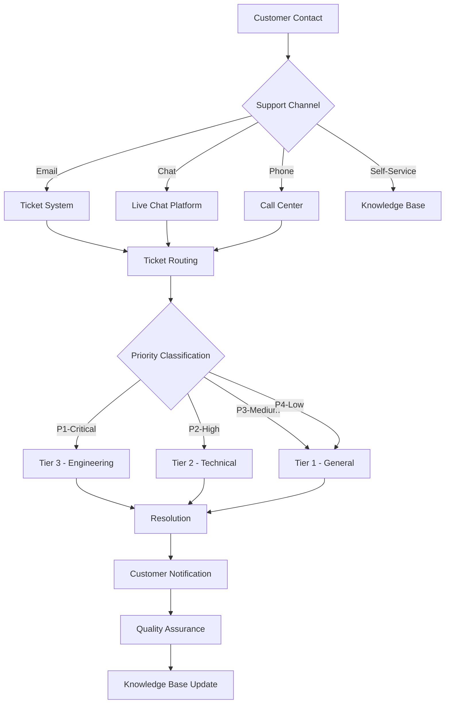

# SecureAI DeepFake Detection System
## Help Desk System & Support Infrastructure

### 🎧 Comprehensive Support Operations

This guide covers the complete help desk system, support processes, and infrastructure for providing world-class customer support.

---

## 🎯 Support Infrastructure Overview

### **Support System Architecture**



### **Support Components**

#### **1. Ticketing System**
- **Platform**: Zendesk / Freshdesk / ServiceNow
- **Purpose**: Centralized ticket management
- **Features**: Auto-routing, SLA tracking, escalation automation
- **Integration**: Email, chat, phone, API

#### **2. Knowledge Base**
- **Platform**: Confluence / Help Scout / Custom
- **Purpose**: Self-service support
- **Content**: Articles, FAQs, tutorials, troubleshooting
- **Search**: Full-text search with AI assistance

#### **3. Live Chat**
- **Platform**: Intercom / Drift / LiveChat
- **Purpose**: Real-time customer support
- **Hours**: Business hours (Starter/Pro), 24/7 (Enterprise)
- **Features**: Chatbot + human handoff

#### **4. Phone Support**
- **Platform**: RingCentral / 8x8 / Five9
- **Purpose**: Voice support for complex issues
- **Hours**: Business hours (Pro), 24/7 (Enterprise)
- **Features**: IVR, call routing, recording

#### **5. Customer Portal**
- **Platform**: Custom web application
- **Purpose**: Self-service and account management
- **Features**: Ticket tracking, knowledge base, account settings

---

## 📞 Support Channels

### **Channel Overview**

| Channel | Availability | Response Time | Best For |
|---------|--------------|---------------|----------|
| **Email** | 24/7 submission | 2-8 hours | Non-urgent issues |
| **Live Chat** | Business hours | 5-30 minutes | Quick questions |
| **Phone** | Business hours+ | Immediate | Urgent issues |
| **Portal** | 24/7 | Self-service | Account management |
| **Community Forum** | 24/7 | Community-driven | Peer support |
| **Emergency Hotline** | 24/7 | Immediate | Critical issues |

### **Email Support**

#### **Support Email Addresses**
```
General Support: support@secureai.com
Technical Support: technical@secureai.com
Billing Support: billing@secureai.com
Security Issues: security@secureai.com
Enterprise Support: enterprise-support@secureai.com
```

#### **Email Response SLA**

| Tier | Priority | Response Time | Resolution Target |
|------|----------|---------------|-------------------|
| **Starter** | P1 | 8 hours | 48 hours |
| **Starter** | P2-P4 | 24 hours | 72 hours |
| **Professional** | P1 | 4 hours | 24 hours |
| **Professional** | P2-P4 | 8 hours | 48 hours |
| **Enterprise** | P1 | 1 hour | 4 hours |
| **Enterprise** | P2-P4 | 4 hours | 24 hours |

#### **Email Template Structure**

```
From: SecureAI Support <support@secureai.com>
To: customer@company.com
Subject: [Ticket #12345] Your SecureAI Support Request
Priority: [P1/P2/P3/P4]

Dear [Customer Name],

Thank you for contacting SecureAI Support.

Ticket Details:
- Ticket ID: #12345
- Priority: P2 (High)
- Status: In Progress
- Assigned To: [Agent Name]

Issue Summary:
[Brief description of the issue]

Current Status:
[What we're doing to resolve]

Next Steps:
[What customer needs to do, if anything]

Expected Resolution: [Timeframe]

You can track this ticket at: https://support.secureai.com/tickets/12345

Best regards,
[Agent Name]
SecureAI Support Team
```

### **Live Chat Support**

#### **Chat Widget Configuration**
```javascript
// Live chat integration
<script>
window.intercomSettings = {
  app_id: "secureai_app_id",
  name: "Customer Name",
  email: "customer@company.com",
  user_id: "customer_123",
  company: {
    id: "company_456",
    name: "Customer Company",
    plan: "professional"
  },
  // Custom data
  subscription_tier: "professional",
  analyses_this_month: 1234,
  last_analysis_date: "2025-01-27"
};
</script>
```

#### **Chat Hours**
```yaml
Starter Tier:
  - Monday-Friday: 9 AM - 5 PM EST
  - Weekends: Chatbot only
  - Holidays: Closed

Professional Tier:
  - Monday-Friday: 8 AM - 8 PM EST
  - Weekends: 10 AM - 4 PM EST
  - Holidays: Limited hours

Enterprise Tier:
  - 24/7/365 coverage
  - Dedicated chat queue
  - Priority response
```

### **Phone Support**

#### **Support Phone Numbers**
```
Main Support Line: +1-800-SECURE-AI (732-8734)
  - Press 1: General support
  - Press 2: Technical support
  - Press 3: Billing
  - Press 4: Enterprise support
  - Press 9: Emergency hotline

International Numbers:
  - UK: +44-20-XXXX-XXXX
  - EU: +49-30-XXXX-XXXX
  - APAC: +65-XXXX-XXXX
```

#### **IVR Script**
```
"Thank you for calling SecureAI Support.

For quality and training purposes, this call may be recorded.

If this is a critical system outage affecting multiple users, press 9 now.

Otherwise, please select from the following options:

Press 1 for general support and account questions
Press 2 for technical support and API issues
Press 3 for billing and subscription questions
Press 4 for enterprise customer support
Press 5 to speak with a sales representative
Press 0 to repeat these options

Or stay on the line to speak with the next available agent."
```

---

## 🎫 Ticket Management System

### **Ticket Lifecycle**

```
┌─────────────┐
│   Created   │ ← Customer submits request
└──────┬──────┘
       │
       ▼
┌─────────────┐
│   Assigned  │ ← Auto-routed to appropriate tier
└──────┬──────┘
       │
       ▼
┌─────────────┐
│ In Progress │ ← Agent working on resolution
└──────┬──────┘
       │
       ├──────────┐
       ▼          ▼
┌─────────────┐ ┌──────────────┐
│  Escalated  │ │   Pending    │ ← Waiting for customer
└──────┬──────┘ └──────┬───────┘
       │               │
       ▼               ▼
┌─────────────┐ ┌──────────────┐
│  Resolved   │ │   Resolved   │
└──────┬──────┘ └──────┬───────┘
       │               │
       └───────┬───────┘
               ▼
        ┌─────────────┐
        │   Closed    │ ← Customer confirms or auto-close
        └─────────────┘
```

### **Ticket Priority Matrix**

| Priority | Definition | Response Time | Examples |
|----------|------------|---------------|----------|
| **P1 - Critical** | System down, all users affected | 1-8 hours | Complete outage, data breach, security incident |
| **P2 - High** | Major functionality broken | 4-24 hours | API failures, batch processing down, login issues |
| **P3 - Medium** | Minor functionality impaired | 8-48 hours | Individual feature bug, slow performance |
| **P4 - Low** | Minimal impact | 24-72 hours | Cosmetic issues, feature requests, questions |

### **Automatic Ticket Routing Rules**

```yaml
Routing Rules:

1. Subject Line Keywords:
   "login", "password", "access" → Account Support Queue
   "api", "integration", "error code" → Technical Support Queue
   "bill", "invoice", "payment" → Billing Queue
   "security", "breach", "incident" → Security Queue (High Priority)

2. Customer Tier:
   Enterprise → Enterprise Queue (Priority)
   Professional → Professional Queue
   Starter → General Queue

3. Previous Ticket History:
   Repeat issue → Escalate to Tier 2
   VIP customer → Priority routing

4. Time of Day:
   Business hours → Live agent
   After hours → Ticket queue (Enterprise gets on-call)

5. Issue Type:
   System outage → Immediate escalation to Tier 3
   Security incident → Security team + Management notification
   Compliance issue → Compliance team notification
```

### **Ticket Template**

```yaml
Ticket ID: TICK-20250127-001
Created: 2025-01-27 10:30:00 UTC
Updated: 2025-01-27 11:15:00 UTC
Status: In Progress
Priority: P2 (High)

Customer Information:
  Name: John Doe
  Email: john.doe@company.com
  Company: Example Corp
  Tier: Professional
  User ID: USER-12345

Issue Details:
  Category: Technical - API
  Subcategory: Authentication
  Subject: API authentication failing with 401 error
  
  Description:
  "We're getting 401 Unauthorized errors when calling the /analyze/video 
  endpoint. The API token was generated yesterday and should be valid."
  
  Steps to Reproduce:
  1. Generate API token via dashboard
  2. Make POST request to /api/v1/analyze/video
  3. Include Authorization: Bearer [token] header
  4. Receive 401 error response
  
  Environment:
  - API client: Python requests library
  - Version: Latest
  - Token generated: 2025-01-26
  
  Attachments:
  - screenshot_error.png
  - api_request_log.txt

Assignment:
  Assigned To: Jane Smith (Tier 2 Technical Support)
  Team: Technical Support
  Queue: API Issues

Activity Log:
  2025-01-27 10:30:00 - Ticket created by customer
  2025-01-27 10:32:00 - Auto-assigned to Technical Support queue
  2025-01-27 10:45:00 - Jane Smith claimed ticket
  2025-01-27 11:00:00 - Jane requested additional information
  2025-01-27 11:15:00 - Customer provided logs

Internal Notes:
  "Checking if token has correct permissions. Verified token is active.
  Reviewing customer's code sample to identify issue."

Resolution:
  [To be filled when resolved]

Customer Satisfaction:
  [To be filled after resolution]
```

---

## 📊 Support Metrics & KPIs

### **Key Performance Indicators**

#### **Response & Resolution Metrics**
```yaml
First Response Time (FRT):
  Target: <2 hours (all tiers combined)
  Measurement: Time from ticket creation to first agent response
  SLA Adherence: >95%

Time to Resolution (TTR):
  Target: <24 hours (all priorities combined)
  Measurement: Time from creation to resolution
  SLA Adherence: >90%

First Contact Resolution (FCR):
  Target: >70%
  Measurement: % of tickets resolved on first contact
  No escalation or follow-up required
```

#### **Quality Metrics**
```yaml
Customer Satisfaction (CSAT):
  Target: >90%
  Measurement: Post-ticket survey (1-5 scale)
  Survey sent: After ticket closure
  Response rate target: >50%

Net Promoter Score (NPS):
  Target: >50
  Measurement: Quarterly survey
  Question: "Would you recommend SecureAI?"
  Scale: 0-10

Ticket Reopen Rate:
  Target: <10%
  Measurement: % of tickets reopened within 7 days
  Indicates: Quality of initial resolution
```

#### **Efficiency Metrics**
```yaml
Tickets per Agent per Day:
  Target: 15-20 tickets (Tier 1)
  Target: 8-12 tickets (Tier 2)
  Target: 3-5 tickets (Tier 3)

Escalation Rate:
  Target: <20%
  Measurement: % of tickets escalated to higher tier
  Lower is better (indicates Tier 1 effectiveness)

Knowledge Base Deflection:
  Target: >40%
  Measurement: % of customers who find answers without tickets
  Higher is better (reduces ticket volume)
```

---

## 📚 Knowledge Base Structure

### **Knowledge Base Categories**

```
SecureAI Help Center
├── Getting Started
│   ├── Account Setup
│   ├── First Login
│   ├── Profile Configuration
│   ├── Quick Start Guide
│   └── Video Tutorials
│
├── Core Features
│   ├── Video Analysis
│   │   ├── Single Video Upload
│   │   ├── Batch Processing
│   │   ├── API Integration
│   │   └── Results Interpretation
│   ├── Reporting
│   │   ├── Generating Reports
│   │   ├── Custom Reports
│   │   └── Scheduled Reports
│   └── Dashboards
│       ├── Default Dashboard
│       ├── Custom Dashboards
│       └── Dashboard Widgets
│
├── Integrations
│   ├── SIEM Platforms
│   │   ├── Splunk Integration
│   │   ├── QRadar Integration
│   │   └── ArcSight Integration
│   ├── SOAR Platforms
│   │   ├── Phantom Integration
│   │   ├── Demisto Integration
│   │   └── Sentinel Integration
│   └── Identity Providers
│       ├── Active Directory
│       ├── Okta
│       └── SAML/SSO Setup
│
├── API Documentation
│   ├── Authentication
│   ├── Video Analysis Endpoints
│   ├── Batch Processing
│   ├── Webhooks
│   └── Error Codes
│
├── Administration
│   ├── User Management
│   ├── Permission Configuration
│   ├── System Settings
│   ├── Monitoring
│   └── Backup & Recovery
│
├── Troubleshooting
│   ├── Login Issues
│   ├── Upload Failures
│   ├── API Errors
│   ├── Performance Problems
│   └── Integration Issues
│
├── Compliance & Security
│   ├── GDPR Compliance
│   ├── CCPA Compliance
│   ├── Data Protection
│   ├── Security Best Practices
│   └── Audit Trails
│
└── Billing & Account
    ├── Subscription Management
    ├── Billing Information
    ├── Usage and Quotas
    └── Upgrading/Downgrading
```

### **Sample Knowledge Base Article**

```markdown
# How to Upload and Analyze Your First Video

**Category:** Getting Started > Video Analysis
**Last Updated:** January 27, 2025
**Estimated Reading Time:** 3 minutes
**Difficulty:** Beginner

## Overview
This guide walks you through uploading and analyzing your first video for 
deepfake detection using SecureAI.

## Prerequisites
- Active SecureAI account
- Video file in supported format (MP4, AVI, MOV, MKV, WEBM)
- File size under 500MB

## Step-by-Step Instructions

### Step 1: Access the Upload Interface
1. Log in to your SecureAI dashboard
2. Click the **"Analyze Video"** button in the main navigation
3. The upload interface will appear

### Step 2: Upload Your Video
You have three options:

**Option A: Drag and Drop**
- Drag your video file from your computer
- Drop it into the upload area

**Option B: File Browser**
- Click "Browse Files"
- Select your video file
- Click "Open"

**Option C: URL Upload**
- Click "Upload from URL"
- Paste the video URL
- Click "Upload"

### Step 3: Configure Analysis Options
Choose your analysis type:
- **Quick** (< 1 minute): Fast screening
- **Comprehensive** (2-5 minutes): Detailed analysis (recommended)
- **Security-focused** (3-7 minutes): Maximum scrutiny

Optional settings:
- ☑️ Detailed forensic analysis
- ☑️ Audio deepfake detection
- ☑️ Metadata examination
- ☑️ Generate blockchain proof

### Step 4: Start Analysis
Click the **"Start Analysis"** button

### Step 5: Monitor Progress
Watch the progress bar and status updates:
- Video preprocessing
- Face detection
- Facial landmark analysis
- Temporal consistency check
- Audio analysis
- Metadata examination

### Step 6: Review Results
When complete, you'll see:
- Overall verdict (Deepfake / Real)
- Confidence score (0-100%)
- Risk level (Low / Medium / High / Critical)
- Detection breakdown by technique
- Recommended actions

## What the Results Mean

| Confidence | Risk Level | Meaning |
|------------|------------|---------|
| 90-100% | Critical | Definite deepfake - investigate immediately |
| 80-89% | High | Probable deepfake - manual review recommended |
| 60-79% | Medium | Suspicious - additional analysis suggested |
| 40-59% | Low | Uncertain - monitor |
| 0-39% | Very Low | Likely authentic |

## Next Steps
- Download detailed report (PDF)
- Create incident (if high risk)
- Share results with team
- Configure alerts for future analyses

## Common Issues

**Upload fails:**
- Check file size (<500MB)
- Verify format (MP4, AVI, MOV, MKV, WEBM)
- Check internet connection

**Slow analysis:**
- Large files take longer
- Use "Quick" analysis for faster results
- Check system status page

## Related Articles
- Understanding Confidence Scores
- Generating Analysis Reports
- Batch Processing Multiple Videos
- API Integration Guide

## Was this article helpful?
[Yes 👍] [No 👎]

## Still need help?
[Contact Support] [Live Chat] [Community Forum]
```

---

## 🚨 Escalation Procedures

### **Escalation Matrix**

```yaml
Tier 1 → Tier 2 Escalation:
  Criteria:
    - Technical issue beyond basic troubleshooting
    - API or integration problems
    - Configuration issues
    - After 30 minutes of unsuccessful troubleshooting
  
  Process:
    1. Document all troubleshooting steps
    2. Assign to Tier 2 queue
    3. Notify Tier 2 team lead
    4. Update customer with escalation notice
  
  Response Time:
    - P1: Immediate
    - P2: 1 hour
    - P3: 4 hours
    - P4: 8 hours

Tier 2 → Tier 3 Escalation:
  Criteria:
    - System bugs or defects
    - Performance issues requiring code changes
    - Complex integration problems
    - After 4 hours of unsuccessful resolution
  
  Process:
    1. Create detailed technical summary
    2. Assign to Engineering queue
    3. Engineering team lead notified
    4. Account manager notified (Enterprise)
    5. Customer updated with timeline
  
  Response Time:
    - P1: Immediate
    - P2: 2 hours
    - P3: 8 hours
    - P4: 24 hours

Tier 3 → Management Escalation:
  Criteria:
    - Critical customer impact
    - Enterprise customer P1 issue
    - Potential data breach or security incident
    - Legal or compliance issues
    - Major system outage
  
  Process:
    1. Notify VP of Engineering
    2. Notify VP of Customer Success
    3. Activate incident response team
    4. Executive communication to customer
    5. Hourly status updates
  
  Response Time: Immediate
```

### **Escalation Decision Tree**

```
Issue Reported
    │
    ▼
Is it a system outage? ──Yes──> Immediate Tier 3
    │                            + Management notification
    No
    │
    ▼
Is it a security incident? ──Yes──> Immediate Security Team
    │                                + Tier 3 + Management
    No
    │
    ▼
Is customer Enterprise tier? ──Yes──> Assign to Enterprise queue
    │                                  + Notify account manager
    No
    │
    ▼
Can Tier 1 resolve? ──Yes──> Tier 1 handles
    │
    No
    │
    ▼
Requires technical expertise? ──Yes──> Escalate to Tier 2
    │
    No
    │
    ▼
Requires code changes? ──Yes──> Escalate to Tier 3
    │
    No
    │
    ▼
Standard Tier 1 handling
```

### **Escalation Notification Template**

```
To: tier2-support@secureai.com
CC: support-manager@secureai.com
Subject: [ESCALATION] [P2] API Authentication Issues - Ticket #12345

ESCALATION NOTICE

Ticket ID: #12345
Customer: Example Corp (Professional Tier)
Priority: P2 (High)
Escalated By: John Smith (Tier 1)
Escalation Time: 2025-01-27 11:30:00 UTC

ISSUE SUMMARY:
Customer experiencing API authentication failures. All API requests returning 
401 Unauthorized despite valid token.

CUSTOMER IMPACT:
- Unable to use API integration
- Blocking their automated workflows
- Affecting 10+ users
- Critical for their operations

TROUBLESHOOTING PERFORMED:
✓ Verified token is active and not expired
✓ Confirmed correct Authorization header format
✓ Tested with curl - same error
✓ Checked customer's API usage logs
✓ Reviewed recent system changes - none found
✗ Cannot reproduce in test environment

REASON FOR ESCALATION:
Issue requires investigation of authentication service logs and potential 
backend debugging. Beyond Tier 1 capabilities.

CUSTOMER EXPECTATION:
Resolution within 4 hours (per SLA)
Has been notified of escalation

REQUESTED ACTION:
- Review authentication service logs
- Check for customer-specific issues
- Test with customer's actual token
- Identify root cause and implement fix

ATTACHMENTS:
- Customer's API request logs
- Screenshot of error
- Troubleshooting notes

PRIORITY JUSTIFICATION:
Professional tier customer, business-critical issue, SLA clock running.
```

---

## 🤖 Support Automation

### **Chatbot Configuration**

#### **Chatbot Capabilities**
```yaml
Automated Responses:
  - FAQs and common questions
  - Account status and usage information
  - Basic troubleshooting steps
  - Knowledge base article suggestions
  - Ticket creation and tracking
  - Business hours and contact information

Handoff to Human:
  Triggers:
    - Customer requests human agent
    - Chatbot confidence <70%
    - Complex technical issues
    - Billing or account changes
    - Customer frustration detected
  
  Process:
    1. Collect issue details from customer
    2. Pre-populate ticket with conversation history
    3. Transfer to appropriate queue
    4. Notify customer of estimated wait time
```

#### **Sample Chatbot Conversation**
```
Chatbot: "Hi! I'm the SecureAI assistant. How can I help you today?"

Customer: "I can't upload my video"

Chatbot: "I'm sorry you're having trouble uploading. Let me help you troubleshoot. 
          Can you tell me what error message you're seeing?"

Customer: "It says file too large"

Chatbot: "I see. The maximum file size is 500MB. How large is your video file?"

Customer: "650MB"

Chatbot: "Your file is larger than our 500MB limit. Here are your options:

1. Compress the video (I can provide instructions)
2. Split the video into smaller parts
3. Upgrade to Enterprise tier for unlimited file sizes

Which option would you prefer?"

Customer: "How do I compress it?"

Chatbot: "Here's a quick guide to compress your video:
          [Link to knowledge base article]
          
          Would you like me to:
          A) Create a support ticket for personalized assistance
          B) Continue with self-service instructions"

Customer: "Create a ticket"

Chatbot: "I've created ticket #12345 for you. A support agent will respond 
          within 4 hours.
          
          Ticket details:
          - Issue: Video upload - file too large
          - Your file size: 650MB
          - Priority: P3 (Medium)
          
          You can track your ticket at: https://support.secureai.com/tickets/12345
          
          Is there anything else I can help with?"
```

### **Automated Ticket Classification**

```python
# Automated ticket classification using ML
def classify_ticket(ticket_text):
    """Classify ticket category and priority"""
    
    categories = {
        "account_access": ["login", "password", "access", "account", "locked"],
        "upload_issues": ["upload", "file", "size", "format", "failed"],
        "api_integration": ["api", "token", "authentication", "401", "403"],
        "performance": ["slow", "timeout", "loading", "performance"],
        "billing": ["bill", "invoice", "payment", "charge", "subscription"],
        "security": ["breach", "security", "hack", "unauthorized", "incident"]
    }
    
    priority_keywords = {
        "critical": ["down", "outage", "breach", "all users", "emergency"],
        "high": ["urgent", "production", "blocking", "critical business"],
        "medium": ["issue", "problem", "error", "bug"],
        "low": ["question", "how to", "feature request"]
    }
    
    # Use NLP to classify
    # This is a simplified example
    ticket_lower = ticket_text.lower()
    
    # Determine category
    category = "general"
    for cat, keywords in categories.items():
        if any(keyword in ticket_lower for keyword in keywords):
            category = cat
            break
    
    # Determine priority
    priority = "medium"
    for pri, keywords in priority_keywords.items():
        if any(keyword in ticket_lower for keyword in keywords):
            priority = pri
            break
    
    return {
        "category": category,
        "priority": priority,
        "confidence": 0.85
    }
```

---

## 📈 Support Analytics Dashboard

### **Real-Time Support Dashboard**

```yaml
Dashboard Widgets:

1. Ticket Overview:
   - Open tickets: 45
   - In progress: 23
   - Pending customer: 12
   - Resolved today: 67
   - Average resolution time: 18.5 hours

2. SLA Compliance:
   - Response SLA: 96.5% ✅
   - Resolution SLA: 92.3% ✅
   - Critical tickets on time: 100% ✅
   - SLA breaches today: 2 ⚠️

3. Team Performance:
   - Agents online: 8/10
   - Average tickets per agent: 16
   - First contact resolution: 72% ✅
   - Customer satisfaction: 4.6/5 ✅

4. Channel Distribution:
   - Email: 45%
   - Live chat: 30%
   - Phone: 15%
   - Self-service: 10%

5. Top Issues (Last 7 days):
   - Upload failures: 23 tickets
   - API authentication: 18 tickets
   - Performance questions: 15 tickets
   - Integration help: 12 tickets
   - Billing questions: 8 tickets

6. Customer Satisfaction:
   - This week: 4.7/5
   - This month: 4.6/5
   - Trend: ↑ Improving
```

---

## 🔧 Support Tools & Systems

### **Essential Support Tools**

#### **1. Ticketing System** (Zendesk/Freshdesk)
```yaml
Features:
  - Multi-channel ticket creation
  - Automated routing and assignment
  - SLA tracking and alerts
  - Custom fields and forms
  - Macros and canned responses
  - Reporting and analytics

Configuration:
  - Queues: Account, Technical, Billing, Security, Enterprise
  - Views: My tickets, Team tickets, Unassigned, Escalated
  - Automations: Auto-close, auto-escalate, SLA warnings
  - Integrations: Email, chat, phone, API
```

#### **2. Knowledge Base** (Confluence/Help Scout)
```yaml
Features:
  - Article editor with rich formatting
  - Version control
  - Search functionality
  - Usage analytics
  - Multi-language support
  - Customer feedback

Content Types:
  - How-to guides
  - Troubleshooting articles
  - Video tutorials
  - FAQ sections
  - Release notes
  - API documentation
```

#### **3. Live Chat** (Intercom/Drift)
```yaml
Features:
  - Real-time messaging
  - Chatbot integration
  - Visitor tracking
  - Team inbox
  - Canned responses
  - Conversation routing

Configuration:
  - Business rules for routing
  - Chatbot fallback to human
  - Availability hours
  - Offline messaging
```

#### **4. Phone System** (RingCentral)
```yaml
Features:
  - IVR (Interactive Voice Response)
  - Call routing
  - Call recording
  - Queue management
  - Analytics and reporting
  - Voicemail to email

Configuration:
  - Support phone tree
  - Queue priority
  - After-hours handling
  - Escalation paths
```

#### **5. Customer Portal**
```yaml
Features:
  - Ticket submission
  - Ticket tracking
  - Knowledge base access
  - Account management
  - Usage dashboard
  - Billing information

Access: https://support.secureai.com
Login: Customer SecureAI credentials
```

---

## 📊 Support Team Structure

### **Team Organization**

```
Support Organization Chart:

VP of Customer Success
├── Director of Support
│   ├── Support Manager - Tier 1
│   │   ├── Support Agent (6 agents)
│   │   └── Chat Specialist (3 agents)
│   ├── Support Manager - Tier 2
│   │   ├── Technical Support Engineer (4 engineers)
│   │   └── Integration Specialist (2 specialists)
│   └── Support Manager - Tier 3
│       ├── Senior Support Engineer (3 engineers)
│       └── On-call Engineer (rotation)
├── Knowledge Base Manager
│   ├── Technical Writer (2 writers)
│   └── Content Coordinator (1 person)
└── Customer Success Manager
    ├── Enterprise Account Manager (3 managers)
    └── Onboarding Specialist (2 specialists)
```

### **Staffing Model**

```yaml
Tier 1 - General Support:
  Headcount: 6-10 agents
  Hours: Business hours + extended
  Ratio: 1 agent per 100 active customers
  Skills: Product knowledge, communication

Tier 2 - Technical Support:
  Headcount: 4-6 engineers
  Hours: Business hours
  Ratio: 1 engineer per 200 active customers
  Skills: API expertise, integration knowledge

Tier 3 - Engineering Support:
  Headcount: 3-5 engineers
  Hours: On-call rotation (24/7)
  Ratio: 1 engineer per 500 active customers
  Skills: Deep technical expertise, development

Enterprise Support:
  Headcount: 3-5 account managers
  Hours: Business hours + flexibility
  Ratio: 1 manager per 10-20 enterprise customers
  Skills: Business acumen, technical knowledge
```

---

## 📞 Emergency Support Procedures

### **Critical Incident Response**

#### **Incident Classification**

**Level 1 - System Outage (P1)**
```yaml
Definition: Complete system unavailable to all customers
Response: Immediate
Notification:
  - All support tiers
  - Engineering team
  - VP of Engineering
  - VP of Customer Success
  - CEO (if >1 hour)

Actions:
  1. Activate incident response team
  2. Update status page
  3. Send customer notifications
  4. Begin troubleshooting
  5. Provide hourly updates
  6. Post-incident review
```

**Level 2 - Security Incident (P1)**
```yaml
Definition: Data breach, unauthorized access, security vulnerability
Response: Immediate
Notification:
  - Security team
  - Engineering team
  - Legal team
  - Executive team
  - Affected customers

Actions:
  1. Activate security incident response
  2. Contain and assess impact
  3. Notify affected customers
  4. Regulatory notification (if required)
  5. Forensic investigation
  6. Remediation and prevention
```

**Level 3 - Enterprise Customer Critical (P1)**
```yaml
Definition: Enterprise customer with business-critical issue
Response: 1 hour
Notification:
  - Tier 3 support
  - Account manager
  - Engineering team
  - VP of Customer Success

Actions:
  1. Immediate response to customer
  2. Assign senior engineer
  3. Provide direct communication channel
  4. Work until resolution
  5. Executive follow-up
```

---

*This comprehensive help desk system provides the foundation for delivering world-class customer support for the SecureAI DeepFake Detection System.*
